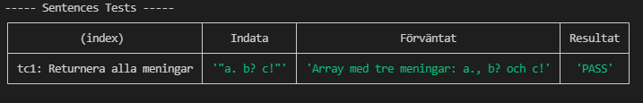
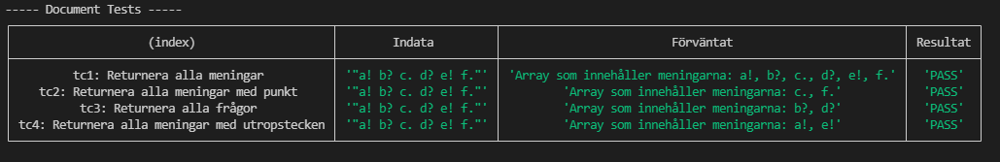

## Testfall
<!-- Lista de enskilda testfallen. **Fetmarkera** sådant som du själv fyllt i. En rad per testfall. -->

### Sentence

Automatiska testfall
| Namn      | Indata | input | Förväntat | PASS/FAIL |
| --------- | --------- | ------ | ------- | ------ |
|    TC1: Returnera mening       |   "En mening."   |  -   |  "En mening."      | PASS |
|    TC2: Returnera en fråga       |   "En mening?"    |  -    |  "En mening?"     | PASS |
|    TC3: Returnera ett utrop       |   "En mening!"     |  -   |  "En mening!"      | PASS |
|    TC4: Få end token typ DOT       |   "En mening."    |  -    |  "DOT"      | PASS |
|    TC5: Få end token typ DOT       |   "a? b! c."      |  -  |  "DOT"      | PASS |
|    TC6: Få end token typ QUESTION       |   "En mening?"   |  -     |  "QUESTION"      | PASS |
|    TC7: Få end token typ QUESTION       |   "a. b! c?"     |  -   |  "QUESTION"      | PASS |
|    TC8: Få end token typ EXCLAMATION       |   "En mening!"    |  -    |  "EXCLAMATION"      | PASS |
|    TC9: Få end token typ EXCLAMATION       |   "a. b? c!"     |  -   |  "EXCLAMATION"      | PASS |
|    TC10: Stega till nästa token       |   "En mening."     |  [>]   |  värde: "mening", typ: "WORD"      | PASS |
|    TC11: Stega fram sedan tillbaks token       |   "En mening."  |  [><]      |  värde: "En", typ: "WORD"     | PASS |
|    TC12: Stega bakåt till sista token       |   "En mening."      |  [<]  |  värde: ".", typ: "DOT"      | PASS |
|    TC13: Stega fram tills första token är aktiv igen       |   "En mening."      |  [>>>]  |  värde: "En", typ: "WORD"      | PASS |
|    TC14: Stega bakåt tills första token är aktiv igen       |   "En mening."    |  [<<<]    |  värde: "En", typ: "WORD"      | PASS |

#### Resultat

### Sentences

Automatiska testfall
| Namn      | Indata | Förväntat | PASS/FAIL |
| --------- | --------- | ------ | ------- |
|    TC1: Returnera alla meningar       |   "a. b? c!"        |  Array med tre meningar: a., b? och c!      | PASS |

#### Resultat

### Document

Automatiska testfall

| Namn      | Indata | Förväntat | PASS/FAIL |
| --------- | --------- | ------ | ------- |
|    TC1: Returnera alla meningar       |   "a! b? c. d? e! f."        |  Array som innehåller meningarna: a!, b?, c., d?, e!, f.      | PASS |
|    TC2: Returnera alla meningar med punkt       |   "a! b? c. d? e! f."        |  Array som innehåller meningarna: c., f.      | PASS |
|    TC3: Returnera alla frågor       |   "a! b? c. d? e! f."        |  Array som innehåller meningarna: b?, d?      | PASS |
|    TC4: Returnera alla meningar med utropstecken       |   "a! b? c. d? e! f."        |  Array som innehåller meningarna: a!, e!      | PASS |

#### Resultat

### PrettyPrinter

Manuella testfall
| Namn      | Indata | Förväntat | PASS/FAIL |
| --------- | --------- | ------ | ------- |
|    TC1: En vanlig mening       |   "En mening."        |  grön text: "0. En mening."     | PASS |
|    TC2: Två vanliga meningar       |   "En mening. Annan mening."        |  grön text: "0. En mening." och "1. Annan mening."     | PASS |
|    TC3: En fråga       |   "En fråga?"        |  röd text: "0. En mening."     | PASS |
|    TC4: Två frågor       |   "En fråga? Annan fråga?"        |  röd text: "0. En mening." och "1. Annan fråga?"     | PASS |
|    TC5: En mening med utropstecken       |   "En mening.!"        |  vit text med understreck: "0. En mening!"     | PASS |
|    TC6: Två meningar med utropstecken       |   "En mening.! Annan mening!"        |  vit text med understreck: "0. En mening!" och "1. Annan mening!"     | PASS |
|    TC7: En vanlig mening och en fråga       |   "Mening. fråga?"        |  grön text: "0. Mening.", röd text: "1. fråga?"     | PASS |
|    TC8: En vanlig mening, en fråga och ett utrop       |   "Mening. fråga? utrop!"        |  grön text: "0. Mening.", röd text: "1. fråga?", vit text med understreck: "2. utrop!"     | PASS |