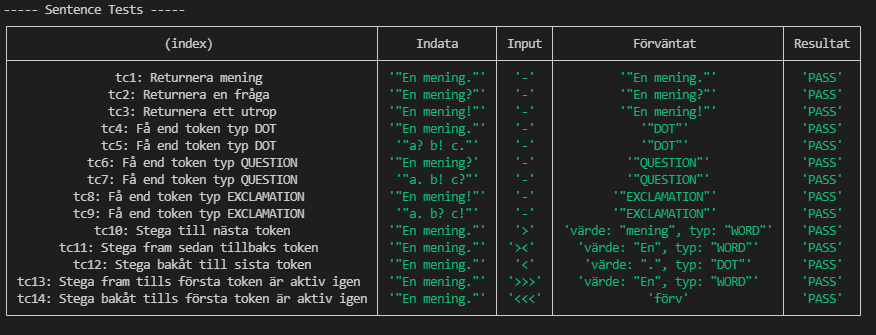
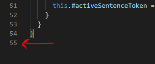

# Mall för inlämning laboration 2, 1dv610

## Checklista
  - [x] Jag har skrivit all kod och reflektioner själv. Jag har inte använt mig av andras kod för att lösa uppgiften.
  - [x] Mina testresultat är skrivna utifrån utförd testning ( och inte teoretiskt, "det bör fungera" :) )
  - [x] De enda statiska metoder eller funktioner utanför klasser som jag har är för att starta upp min testapplikation ex main(java).
  - [x] De enda bibliotek och färdiga klasser som används är sådana som måste användas (eller som används för att testa modulen).

## Egenskattning och mål
  - [ ] Jag är inte klar eftersom jag vet att jag saknar något. Då skall du inte lämna in!
  - [x] Jag eftersträvar med denna inlämning godkänt betyg (E-D)
    - [x] De flesta testfall fungerar (enstaka testfall kan misslyckas, tydligt vilka)
    - [x] Koden är förberedd på återanvändning
    - [x] All kod samt historik finns i git 
    - [x] Reflektionerna är skrivna
    - [x] Koden är läsbar
  - [ ] Jag eftersträvar med denna inlämning högre betyg (C) och anser mig uppfylla alla extra krav för detta. 
    - [x] Jag är noga i min testning
    - [x] En del av testfallen är automatiserade (Tokenizer/Parser/PP), viss del kan vara manuellt testad.
    - [ ] Det finns en tydlig beskrivning i hur mina moduler skall användas. 
    - [ ] Mina reflektioner visar tydligt att jag förstått bokens koncept.
  - [ ] Jag eftersträvar med denna inlämning högsta betyg (A-B) 
    - [ ] Sammanhängande reflektion som ger ett gott helhetsintryck och visar detaljerad förståelse för kodkvalitet.
    - [ ] Min kod är ... (pussar fingrar och gör smackljud)
    - [ ] Extrauppgift parser finns med som egen modul(er)

Förtydligande: Examinator kommer sätta betyg oberoende på vad ni anser. Att ha "saker" från högre betygsnivåer verkar positivt och kan väga upp brister i inlämningen.

## Komponenter och återanvändning
 <!-- * Länka in URL om du använder olika repositorier för dina olika komponenter. 
 * Beskriv komponenterna och hur de skall användas.
 * Beskriv hur du anpassat din kod och instruktioner för att någon annan programmerare skall kunna använda dina komponenter. Om du skrivit instruktioner för din användare länka till dessa. Om inte beskriv här hur någon skall göra. 
 * Beskriv hur du säkerhetställt att beroendena mellan komponenterna är som beskrivs i laborationen.  -->
 * Tokenizer repo (senaste versionen finns redan i detta projekt): [Länk](https://gitlab.lnu.se/1dv610/student/oe222ez/l1/-/tree/tokenizer-l2) (branch tokenizer-l2 är den uppdaterade versionen!)
 * Komponenterna har delats in i en mapp för parser, prettyPrinter och tokenizer. Applikationen är byggt för att användaren ska skicka in en sträng till start metoden i PrettyPrinter, som sedan returnerar strängarna. prettyPrintern beror på parsern och parsern beror på tokenizern.
 * Eftersom prettyPrintern beror på parsern så är den svår att återanvända för en annan programmerare i ett annat projekt. parsern och tokenizern skulle tillsammans kunna användas i ett annat projekt eftersom parsern använder tokenizern för att skapa meningar. Tokenizern skulle kunna användas av någon annan utan pretty printern eller parsern. Eftersom den kan skapa tokens från en grammatik och en sträng.
 * Jag har sett till så att beroendena följs enligt kraven genom att endast tillåta komponenterna att kommunicera i ordningen prettyPrinter -> parser -> tokenizer.

## Beskrivning av min kod
<!-- Beskriv din kod på en hög abstraktionsnivå. En kort beskrivning av dina viktigaste klasser och metoder i dina komponenter. Skapa gärna ett klassdiagram som bild. Beskriv relationerna mellan klasserna mellan komponenter. -->
PrettyPrinter består av en klass (PrettyPrinter). Klassen ansvarar för att skicka input till parser och skriva ut den returnerade datan från parsern på ett korrekt sätt enligt reglerna för mening, utrop och fråga.

Parser består av Document, Sentences och Sentence klasserna. Document lagrar Sentences objektet och kan returnera alla eller en specifik typ av meningar. Sentences skapar meningar (Sentence) och har en metod för att hämta ut meningarna. Sentence lagrar en menings tokens och hanterar aktiv menings token

Tokenizer har tre klasser. ActiveToken, Tokenizer, Token och en fil med ett grammatikobjekt. ActiveToken är den klass som anropas först om aktiv token ska användas. Då skickas strängen från ActiveToken till tokenizer som tokeniserar strängen (skapar Token objekt) och returnerar alla tokens till ActiveToken som sedan hanterar stegningen fram och tillbaks.

## Hur jag testat
<!-- Beskriv hur du kommit fram till om din kod fungerar. Beskriv de olika delarna och hur de testats. Screenshots från manuell testning. -->
Jag har använt automatiska tester för alla klasser förutom PrettyPrinter, eftersom den kräver att man läser resultat från terminalen. Varje klass som testas automatiskt har en egen fil med en funktion för varje testfall.

## Testfall
<!-- Lista de enskilda testfallen, eller länka in detta.

| Namn      | Indata | Förväntat Utfall | PASS/FAIL |
| --------- | ------ | ---------------- | --------- |
|           |        |                  |           |

Screenshots från automatisk testning. -->
<!-- Lista de enskilda testfallen. **Fetmarkera** sådant som du själv fyllt i. En rad per testfall. -->

### Sentence

Automatiska testfall
| Namn      | Indata | input | Förväntat | PASS/FAIL |
| --------- | --------- | ------ | ------- | ------ |
|    TC1: Returnera mening       |   "En mening."   |  -   |  "En mening."      | PASS |
|    TC2: Returnera en fråga       |   "En mening?"    |  -    |  "En mening?"     | PASS |
|    TC3: Returnera ett utrop       |   "En mening!"     |  -   |  "En mening!"      | PASS |
|    TC4: Få end token typ DOT       |   "En mening."    |  -    |  "DOT"      | PASS |
|    TC5: Få end token typ DOT       |   "a? b! c."      |  -  |  "DOT"      | PASS |
|    TC6: Få end token typ QUESTION       |   "En mening?"   |  -     |  "QUESTION"      | PASS |
|    TC7: Få end token typ QUESTION       |   "a. b! c?"     |  -   |  "QUESTION"      | PASS |
|    TC8: Få end token typ EXCLAMATION       |   "En mening!"    |  -    |  "EXCLAMATION"      | PASS |
|    TC9: Få end token typ EXCLAMATION       |   "a. b? c!"     |  -   |  "EXCLAMATION"      | PASS |
|    TC10: Stega till nästa token       |   "En mening."     |  [>]   |  värde: "mening", typ: "WORD"      | PASS |
|    TC11: Stega fram sedan tillbaks token       |   "En mening."  |  [><]      |  värde: "En", typ: "WORD"     | PASS |
|    TC12: Stega bakåt till sista token       |   "En mening."      |  [<]  |  värde: ".", typ: "DOT"      | PASS |
|    TC13: Stega fram tills första token är aktiv igen       |   "En mening."      |  [>>>]  |  värde: "En", typ: "WORD"      | PASS |
|    TC14: Stega bakåt tills första token är aktiv igen       |   "En mening."    |  [<<<]    |  värde: "En", typ: "WORD"      | PASS |

#### Resultat

### Sentences

Automatiska testfall
| Namn      | Indata | Förväntat | PASS/FAIL |
| --------- | --------- | ------ | ------- |
|    TC1: Returnera alla meningar       |   "a. b? c!"        |  Array med tre meningar: a., b? och c!      | PASS |

#### Resultat

### Document

Automatiska testfall

| Namn      | Indata | Förväntat | PASS/FAIL |
| --------- | --------- | ------ | ------- |
|    TC1: Returnera alla meningar       |   "a! b? c. d? e! f."        |  Array som innehåller meningarna: a!, b?, c., d?, e!, f.      | PASS |
|    TC2: Returnera alla meningar med punkt       |   "a! b? c. d? e! f."        |  Array som innehåller meningarna: c., f.      | PASS |
|    TC3: Returnera alla frågor       |   "a! b? c. d? e! f."        |  Array som innehåller meningarna: b?, d?      | PASS |
|    TC4: Returnera alla meningar med utropstecken       |   "a! b? c. d? e! f."        |  Array som innehåller meningarna: a!, e!      | PASS |

#### Resultat

### PrettyPrinter

Manuella testfall
| Namn      | Indata | Förväntat | PASS/FAIL |
| --------- | --------- | ------ | ------- |
|    TC1: En vanlig mening       |   "En mening."        |  grön text: "0. En mening."     | PASS |
|    TC2: Två vanliga meningar       |   "En mening. Annan mening."        |  grön text: "0. En mening." och "1. Annan mening."     | PASS |
|    TC3: En fråga       |   "En fråga?"        |  röd text: "0. En mening."     | PASS |
|    TC4: Två frågor       |   "En fråga? Annan fråga?"        |  röd text: "0. En mening." och "1. Annan fråga?"     | PASS |
|    TC5: En mening med utropstecken       |   "En mening.!"        |  vit text med understreck: "0. En mening!"     | PASS |
|    TC6: Två meningar med utropstecken       |   "En mening.! Annan mening!"        |  vit text med understreck: "0. En mening!" och "1. Annan mening!"     | PASS |
|    TC7: En vanlig mening och en fråga       |   "Mening. fråga?"        |  grön text: "0. Mening.", röd text: "1. fråga?"     | PASS |
|    TC8: En vanlig mening, en fråga och ett utrop       |   "Mening. fråga? utrop!"        |  grön text: "0. Mening.", röd text: "1. fråga?", vit text med understreck: "2. utrop!"     | PASS |

## Kapitelreflektioner för kapitel 2-11
<!-- Gå igenom all kod inklusive kod från laboration 1 och uppdatera enligt bokens clean code kapitel 2-11 och det vi diskuterat på föreläsningar och workshops. Skriv en kort (4-6 meningar) reflektion för varje kapitel om hur just det kapitlet har påverkat eller inte påverkat din kod. Använd bokens termer. Ge exempel med läsbara screenshots från er kod till varje reflektion. 

Fokusera på tydlighet, variation, ärlighet och vad som är intressant. Exempelvis om du har icke självklara överväganden med olika kvalitetsregler som står i konflikt med varandra så är dessa extra intressanta. -->
Clean code reflektion

kap 2

När jag skapar metoder och variabler har jag fokuserat på att vara så tydlig som möjligt. På sidan 18 i CC (clean code) nämns det att att namn ska ha en tydlig avsikt. T.ex. i klassen Document har jag get metoderna för att få meningar getAllSentences, getAllDotSentences, getAllQuestionSentences och getAllExclamationSentences. Dessa namn förklarar tydligt att något hämtas (get), att det är alla (All), vilken typ (Dot/Question/Exclamation) och att det är meningar (Sentences).

Kap 3

Enligt clean code (s. 40) ska så lite argument skickas till funktioner som möjligt. Eftersom argument gör koden mer svårläst. Därför har jag försökt att ha så många metoder som möjligt utan argument (niladic metoder). I vissa fall har jag varit tvungen att använda ett (monadic) eller två (dyadic) argument. Ett exempel är i PrettyPrinter klassen där en mening, fråga eller utrop ska skrivas ut i terminalen. Eftersom kravet är att både index och meningen ska visas så krävdes två argument.

Kap 4

Enligt clean code (s.55) kan kommentarer undvikas genom att använda tydliga variabel och metodnamn istället för att ha ett otydligt namn och en kommentar. Även om kommentarer inte måste undvikas helt så har jag valt att inte använda några kommentarer. Istället har jag fokuserat på att använda tydliga namn, som i de flesta fallen är lika tydliga som en kommentar till ett otydligt namn hade varit.

Kap 5

Eftersom små filer är lättare att förstå (clean code s.77) så har jag försökt att ha en låg vertikal storlek i filerna. I parsern finns det endast en klass per fil och varje fil är runt 50-70 rader lång. Författarens applikation FitNesse har en vertikal storlek runt 200 rader i genomsnitt. Det innebär att mina filer är långt under gränsen för en lagom stor vertikal storlek, vilket även jag själv tycker.

kap 6

Objekt ska endast dela sin data på ett abstrakt sätt (clean code . 94-95). Detta uppnås genom att använda privata attribut och använda metoder för att dela objektets data. Anledningen är att andra metoder annars kan ändra objektets data utan att den nya datan kontrolleras. Detta har jag följt genom att endast använda privata attribut i klasserna och genom att använda metoder som skapar den data som efterfrågas. Exempelvis i Sentence objektet finns en metoden getEndType som endast returnerar meningens typ istället för att returnera alla tokens.

kap 7

Att hantera fel direkt i metoder leder till stora metoder med långa if-satser för varje fel som kan uppstå (s. 104-105). Eftersom långa svårlästa metoder inte är bra så kan man istället använda try-catch satser och kasta fel från metoderna där fel uppstår. Detta gör att långa if-satser inte behövs och fel behöver inte hanteras direkt i metoderna. Enligt CC är det bra att alltid börja med ett try-catch block i en applikation, vilket jag har gjort. I try-catch blocket fångas sedan fel från bland annat getSentenceString i Sentence om ett END token skulle hittas.

kap 8

I projektet finns det en gräns mellan parsern och tokenizern. I projektet har jag implementerat tokenizern direkt i parsern. Eftersom parsern skulle kunna ändras i framtiden så hade ett bättre alternativ varit att skapa ett interface mellan parsern och tokenizern (s.119). Fördelen med ett interface är att parsern inte behöver ändras om funktionaliteten i tokenizern ändras. Istället kan alla ändringar göras på ett ställe i interfacet mellan tokenizern och parsern.

Kap 9

Det är viktigt att kodens tester är läsbara och tydliga (s.124). Eftersom jag valde att inte använda ett ramverk för testning så delade jag upp testerna i separata filer för varje klass. I varje test fil finns det en funktion för varje testfall. Funktionen är tydligt indelad i tre delar. Första delen skapar objekt och lägger till data, andra hämtar ut data eller går fram och tillbaks (aktiv token) och tredje delen kontrollerar om värdena är korrekta. Jag har även använt tabeller som renderas i terminalen med namn, indata, input, förväntat värde och resultat för att testerna ska vara tydliga att förstå.

kap 10

Enligt clean code ska klasser ha en hög sammanhållning (s.140-141). En klass med hög sammanhållning beskrivs som en klass där så många variabler används av så många metoder som möjligt i klassen. I parsern har jag skapat klasser som fokuserar på en sak, exempelvis klasserna Document, Sentences och Sentence. Sentence är en klass med lite sämre sammanhållning. Det beror på att den både hanterar en mening och aktiv token/stegning mellan aktiva tokens. Om jag hade haft mer tid så hade jag delat upp Sentence i en Sentence och en ActiveSentenceToken klass, eftersom klasserna då endast hade fokuserat på en sak.

Kap 11

Jag har inte använt något designmönster i applikationen. Däremot skulle det vara möjligt att använda exempelvis Factory (s.156) för att skapa Sentence objekten. Då skulle Sentences objektet kunna fokusera på att lagra och returnera meningar istället för att även skapa objekten.

<!-- ### Kodkvalitetskrav för högre betyg
Samma som för för lägre betyg men baka in de 10 reflektionerna från de olika kapitlen till en sammanhängande text som spänner över båda uppgifterna. Du har alltså en enda reflektion fast för både koden i uppgift 1 och uppgift 2. Ca två sidor max. Använd varierade uttryck från boken.  -->

## Laborationsreflektion
<!-- Reflektera över uppgiften utifrån din utveckling som programmerare. 
Vad har du lärt dig och vad ser du fram emot att lära dig? -->
Jag har lärt mig att bli bättre på att skriva tydlig kod. Jag ser fram emot att bli ännu bättre på att skriva tydlig kod och bli bättre på att skriva tester.
